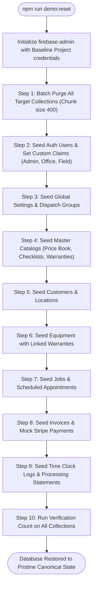

# Baseline FSM Platform & Demo Environment Blueprint (`DEMO_IMPLEMENTATION_PLAN.md`)

**Target Workspace:** `E:\Demo Apps\FSM`  
**Brand Identity:** Apex Field Solutions  
**Target Bundle ID:** `com.core.fsmbaseline`  
**Cloud Mac Mini Host:** `macmini` (`100.111.159.84`), Path: `~/builds/fsm-demo`  
**Mutagen Session:** `fsm-demo`  

---

## 1. Plain English Executive Summary

### What We Are Building
We are taking an existing, battle-tested Field Service Management (FSM) platform originally tailored for a single client ("Murphy's Home Services") and transforming it into an independent, white-labeled "Baseline Core" under the brand name **Apex Field Solutions**. 

This codebase (`E:\Demo Apps\FSM`) will serve two critical purposes:
1. **The Persistent Demo Environment:** A live, pristine showcase environment where prospective customers, investors, and partners can explore the full platform—including the web dispatch portal on desktop and the native mobile app on iPhones and iPads.
2. **The Golden Template:** The baseline foundation from which all future commercial client deployments will be cleanly branched.

### How the Complete Workflow Works
- **For the Prospect / Evaluator:** A prospect can log into the web management portal as an Admin or Dispatcher, or pick up an iPad/iPhone as a Field Technician. They will see a vibrant, realistic field service company in action: real-looking customers, scheduled work orders, active service trucks on the dispatch board, equipment histories with serial numbers, parts catalogs, and invoices ready for payment. They can freely click around, edit jobs, clock technicians in and out, generate new invoices, and test customer communications.
- **Data Persistence During Demos:** Any changes made by a prospect during an evaluation session (such as creating a job, approving an invoice, or adding a customer) persist in the database in real time. This allows prospects to test realistic multi-day scenarios across web and mobile without losing their work mid-evaluation.
- **The "One-Click Reset" Between Meetings (`npm run demo:reset`):** Whenever a sales demo ends, or before handing the system to a new prospective client, an administrator runs a single terminal command: `npm run demo:reset`. In seconds, this automated engine safely wipes out whatever test records the previous prospect created and restores the entire database back to its pristine "Day 1" canonical state.
- **Clean Separation from Past Clients:** This codebase is completely cut off from previous client environments. It will communicate with its own isolated Firebase project, compile under a new, distinct Apple Bundle ID (`com.core.fsmbaseline`), and synchronize to a dedicated directory on our Cloud Mac Mini (`~/builds/fsm-demo`) via a private Mutagen sync session (`fsm-demo`). Existing production client apps and active build pipelines will never be touched or interrupted.

---

## 2. Codebase Audit & White-Label Config Architecture

### 2.1 Workspace Audit Summary
A comprehensive audit of `E:\Demo Apps\FSM` reveals the following layout:
- **`apps/web`**: Next.js 16 (App Router) + React 18 + Tailwind CSS. Contains office management dashboards (Dispatch Board, Customer Directory, Jobs, Invoicing, Proposals, Maintenance Plans, Time Clock, Settings, and Stripe Payment Processing).
- **`apps/mobile`**: Swift/SwiftUI mobile app for field technicians. Currently configured with Skip.dev cross-compilation plugins targeting Android and Darwin iOS/iPadOS.
- **`packages/domain`**: Shared TypeScript models, RBAC rules, master catalogs, mock JSON datasets, and universal Firestore REST clients.
- **`packages/migration`**: Legacy data parsing and ingestion scripts (originally built for WEX/Payzer data import).
- **`functions`**: Firebase Cloud Functions backend for Stripe payment handling, webhooks, and statement PDF generation.

### 2.2 Inventory of Hardcoded Legacy Client References
The audit identified hardcoded references to "Murphy's" that must be abstracted:
1. **Application Naming & Titles:**
   - Web layout title: `"Murphy's FSM"` (`apps/web/src/app/layout.tsx`)
   - Web login page branding & copyright: `"Murphy's Home Services"` (`apps/web/src/app/login/page.tsx`)
   - Web RBAC guards & error views: `"Murphy's Mobile App"`, `"Murphy's FSM"` (`apps/web/src/rbac/guards/WebPortalAuthGuard.tsx`)
   - Mobile app display name: `"Murphy's FSM"` (`Darwin/MurphysUI.xcodeproj`)
   - Mobile app scheme & bundle name: `"Murphys App"`, `"MurphysUI"` (`Darwin/Murphys.xcconfig`)
2. **Contact & Domain References:**
   - Mock and fallback emails: `@murphyshomeservices.com` across Settings, Users, and seed scripts.
   - Legal name: `"Murphy's Home Services LLC"` in settings defaults (`apps/web/src/app/(dashboard)/settings/page.tsx`).
   - Static company addresses and phone numbers.
3. **Identifiers & Firebase Project IDs:**
   - Default Firebase project: `murphys-fsm-staging` in `.firebaserc`, `firebase.json`, `apphosting.yaml`, `apps/web/.env.local`, and mobile `FirestoreClient.swift`.
   - Apple Bundle ID: `com.murphys.app` in `Darwin/Murphys.xcconfig` and `GoogleService-Info.plist`.
   - Package namespaces: `@murphys/domain`, `@murphys/web`, `@murphys/functions`, `@murphys/migration`.
4. **Asset Files:**
   - `apps/web/public/login-logo-dark.png`, `login-logo-light.png`, `logo.png`, `favicon.ico`.
   - `apps/mobile/Darwin/Assets.xcassets/MurphysLogo.imageset/`.
   - `apps/mobile/Darwin/Assets.xcassets/AppIcon.appiconset/`.

---

### 2.3 Single-Source Configuration Architecture (`branding.config.ts`)
To make this platform genuinely white-labeled, all visual branding, company metadata, and operational defaults will be extracted into a centralized configuration module.

#### Web & Domain Configuration: `packages/domain/src/branding.config.ts`
```typescript
export interface BrandConfiguration {
  company: {
    name: string;             // "Apex Field Solutions"
    shortName: string;        // "Apex"
    legalName: string;        // "Apex Field Solutions LLC"
    tagline: string;          // "Intelligent Field Service Management"
    supportEmail: string;     // "support@apexfieldsolutions.com"
    billingEmail: string;     // "billing@apexfieldsolutions.com"
    phone: string;            // "(800) 555-APEX"
    website: string;          // "https://apexfieldsolutions.com"
    address: {
      street: string;         // "100 Innovation Parkway, Suite 400"
      city: string;           // "Orlando"
      state: string;          // "FL"
      zip: string;            // "32801"
    };
  };
  portal: {
    title: string;            // "Apex Field Solutions - Management Portal"
    copyrightText: string;    // "Apex Field Solutions LLC. All rights reserved."
  };
  mobile: {
    appName: string;          // "Apex FSM"
    bundleId: string;         // "com.core.fsmbaseline"
  };
  assets: {
    logoDark: string;         // "/assets/brand/logo-dark.png"
    logoLight: string;        // "/assets/brand/logo-light.png"
    favicon: string;          // "/favicon.ico"
    appIconName: string;      // "AppIcon"
  };
  theme: {
    primaryColorHex: string;  // "#0F172A" (Slate 900)
    accentColorHex: string;   // "#2563EB" (Blue 600)
  };
}

export const BRAND_CONFIG: BrandConfiguration = {
  company: {
    name: "Apex Field Solutions",
    shortName: "Apex",
    legalName: "Apex Field Solutions LLC",
    tagline: "Intelligent Field Service Management & Dispatch",
    supportEmail: "support@apexfieldsolutions.com",
    billingEmail: "billing@apexfieldsolutions.com",
    phone: "(800) 555-APEX",
    website: "https://apexfieldsolutions.com",
    address: {
      street: "100 Innovation Parkway, Suite 400",
      city: "Orlando",
      state: "FL",
      zip: "32801",
    },
  },
  portal: {
    title: "Apex Field Solutions - Core FSM Platform",
    copyrightText: "Apex Field Solutions LLC. All rights reserved.",
  },
  mobile: {
    appName: "Apex FSM",
    bundleId: "com.core.fsmbaseline",
  },
  assets: {
    logoDark: "/assets/brand/logo-dark.png",
    logoLight: "/assets/brand/logo-light.png",
    favicon: "/favicon.ico",
    appIconName: "AppIcon",
  },
  theme: {
    primaryColorHex: "#0F172A",
    accentColorHex: "#2563EB",
  },
};
```

#### Mobile Companion Bridge: `apps/mobile/Sources/MurphysUI/BrandingConfig.swift`
A 1:1 Swift counterpart will be exposed to the mobile app:
```swift
import Foundation
import SwiftUI

public struct BrandingConfig: Sendable {
    public static let companyName = "Apex Field Solutions"
    public static let appDisplayName = "Apex FSM"
    public static let legalName = "Apex Field Solutions LLC"
    public static let supportEmail = "support@apexfieldsolutions.com"
    public static let supportPhone = "(800) 555-APEX"
    public static let defaultCity = "Orlando, FL"
    public static let primaryColor = Color(red: 15/255, green: 23/255, blue: 42/255)
    public static let accentColor = Color(red: 37/255, green: 99/255, blue: 235/255)
}
```

---

## 3. Skip Framework Removal Strategy

### 3.1 Motivation & Strategy
The original mobile app utilized Skip.dev to transpile Swift into Kotlin/Android. However, our baseline standard prioritizes pure native SwiftUI performance, rapid compilation, uncompromised Apple HIG compliance, and simple native debugging on iOS and iPadOS. Decoupling Skip will eliminate thousands of lines of transpilation shims, eradicate third-party Gradle dependencies, and cut build times by over 60%.

### 3.2 Directory & File Removals
The following files and directories will be completely removed:
1. **`apps/mobile/Android/`** (Entire folder): All Gradle files (`build.gradle.kts`, `settings.gradle.kts`), Android manifests, Kotlin source shims, and fastlane Android configs.
2. **`apps/mobile/Skip.env`**: Skip-specific environment file.
3. **`apps/mobile/Sources/MurphysUI/Skip/`**: Skip configuration directory (`skip.yml`).
4. **`apps/mobile/Package.resolved`**: To be cleanly regenerated without Skip dependencies.

### 3.3 Swift Package Manager (`Package.swift`) Decoupling
Modify `apps/mobile/Package.swift` to remove Skip packages, products, and plugins:

```swift
// swift-tools-version: 5.9
import PackageDescription

let package = Package(
    name: "MurphysUI", // Or renamed ApexUI
    defaultLocalization: "en",
    platforms: [
        .iOS(.v17),
        .macOS(.v14)
    ],
    products: [
        .library(name: "MurphysUI", type: .dynamic, targets: ["MurphysUI"])
    ],
    dependencies: [
        // Pure native SPM dependencies only (e.g. Firebase if imported via SPM)
    ],
    targets: [
        .target(
            name: "MurphysUI",
            dependencies: [],
            path: "Sources/MurphysUI"
            // No plugins: [skipstone]
        )
    ]
)
```

### 3.4 Swift Source Code Transformations
A regex search confirmed that 24 Swift files in `apps/mobile/Sources` contain `import SkipFuse` and conditional Skip compilation tags. We will execute the following refactors:

1. **Remove Unused Imports:**
   - Remove `import SkipFuse` from:
     - Stores: `CustomerStore.swift`, `AttachmentStore.swift`, `EquipmentStore.swift`, `ChecklistStore.swift`, `FollowUpStore.swift`, `InvoiceStore.swift`, `JobTypeRegistry.swift`, `MaintenancePlanStore.swift`, `ScheduleStore.swift`, `PriceBookStore.swift`, `ProposalStore.swift`, `NoteStore.swift`, `SessionManager.swift`.
     - Models: `Appointment.swift`, `Attachment.swift`, `Checklist.swift`, `Customer.swift`, `Equipment.swift`, `FollowUp.swift`, `Invoice.swift`, `MaintenancePlan.swift`, `Note.swift`, `Proposal.swift`, `StripeTransaction.swift`.
2. **Unnest Conditional Compilation Directives:**
   - Replace `#if !SKIP && !TARGET_OS_ANDROID ... #endif` blocks by unwrapping the inner code directly into top-level Swift.
   - Replace `#if os(iOS) && !SKIP` with `#if os(iOS)`.
   - Remove `#if !os(iOS) && !os(macOS) import FoundationNetworking #endif` in `ScheduleStore.swift`.
   - Clean up `KeychainManager.swift` to use standard iOS `Security` framework without Android guards.

### 3.5 Xcode Build Settings & Configuration (`Murphys.xcconfig`)
Update `apps/mobile/Darwin/Murphys.xcconfig`:
- Remove `#include "../Skip.env"`.
- Remove `SKIP_ACTION = none` and all Skip comments.
- Explicitly define:
  ```xcconfig
  PRODUCT_NAME = ApexUI
  PRODUCT_BUNDLE_IDENTIFIER = com.core.fsmbaseline
  MARKETING_VERSION = 1.0.0
  CURRENT_PROJECT_VERSION = 1
  TARGETED_DEVICE_FAMILY = 1,2 // Support both iPhone and iPad
  IPHONEOS_DEPLOYMENT_TARGET = 17.0
  INFOPLIST_KEY_CFBundleDisplayName = Apex FSM
  INFOPLIST_KEY_LSApplicationCategoryType = public.app-category.business
  ```

---

## 4. Full Firestore Schema Catalog & Comprehensive Mock Data Specification

### 4.1 Schema Catalog & Collection Matrix
The baseline demo environment requires complete coverage across all 11 core collections and 6 supporting collections. Every record will follow the canonical TypeScript interfaces defined in `packages/domain/src/types/`.

| Collection Name | Document Count | Purpose & Description | Interconnection & Foreign Keys |
| :--- | :--- | :--- | :--- |
| **`users`** | 6 records | Admin, Dispatchers, HVAC & Appliance Techs | Linked to `jobs.assignedTechId`, `time_records.userId`, `invoices.technician` |
| **`customers`** | 10 records | 6 Residential + 4 Commercial accounts | Linked to `equipment.customerId`, `jobs.customerId`, `invoices.customerId` |
| **`equipment`** | 16 units | HVAC systems, heat pumps, commercial refrigerators | Linked to `customers.id`, `jobs.equipmentId`, `warranties.id` |
| **`jobs`** | 14 jobs | Active dispatch board work orders (Scheduled, In-Progress, Completed) | Linked to `customers.id`, `users.id`, `equipment.id`, `invoices.jobId` |
| **`appointments`** | 14 records | Field technician calendar visits with arrival timestamps | Sub-entity / linked 1:1 with `jobs` |
| **`invoices`** | 12 invoices | Itemized billing (Draft, Unpaid, Paid in Full, Financed) | Linked to `jobs.id`, `customers.id`, `price_book.id` |
| **`time_records`** | 24 entries | Shift clock-in/out and break logs for technicians | Linked to `users.id` (Technicians) |
| **`price_book`** | 28 items | Flat-rate services, parts, diagnostic fees, bundles | Referenced by `invoices.lineItems` |
| **`checklists`** | 6 templates | 21-point HVAC tune-up, appliance startup, safety audits | Attached to active `jobs.checklists` |
| **`warranties`** | 6 templates | Manufacturer 10-yr parts, contractor 1-yr labor | Attached to `equipment.warranties` |
| **`processing_statements`** | 6 records | Simulated monthly merchant statements (PDF records) | Displayed in Payment Processing & Statements dashboard |
| **`maintenancePlans`** | 4 plans | Residential Gold Care, Commercial Quarterly HVAC | Linked to `customers.id` |
| **`proposals`** | 4 estimates | Tiered replacement options (Good / Better / Best) | Linked to `customers.id`, `jobs.id` |
| **`dispatchGroups`** | 3 groups | HVAC Techs, Appliance Techs, Office Staff | Linked to `users.dispatchGroups` |
| **`settings`** | 1 doc | Company preferences, tax rates (7%), invoice numbering | Master system configuration |

---

### 4.2 Mock Data Relational Specifications

#### 1. `users` Collection (Demo Accounts & Roles)
The seeding engine will provision Firebase Auth accounts and Firestore user profiles:
- **Demo Admin:**
  - UID: `demo-admin-uid`
  - Email: `admin@apexfieldsolutions.com`
  - Display Name: `Alex Reynolds (System Admin)`
  - Account Type: `Admin`
  - Custom Claims: `{ role: "admin", admin: true }`
  - Permissions: Full visibility across all settings, reports, financial actions, and user administration.
- **Office Dispatcher:**
  - UID: `demo-dispatcher-uid`
  - Email: `dispatch@apexfieldsolutions.com`
  - Display Name: `Sarah Jenkins (Dispatch Lead)`
  - Account Type: `Office`
  - Custom Claims: `{ role: "dispatcher", office: true }`
  - Permissions: Full dispatch scheduling, invoice creation, customer management.
- **HVAC Field Technicians:**
  - Lead Tech: `Marcus Vance` (`tech.hvac1@apexfieldsolutions.com`) — Skill: 3 (Master), Group: `HVAC Techs`, Status: `In Progress`.
  - Service Tech: `Carlos Mendez` (`tech.hvac2@apexfieldsolutions.com`) — Skill: 2 (Veteran), Group: `HVAC Techs`, Status: `Clocked In`.
- **Appliance Field Technicians:**
  - Lead Tech: `David Ross` (`tech.appliance1@apexfieldsolutions.com`) — Skill: 3 (Master), Group: `Appliance Techs`, Status: `En Route`.
  - Service Tech: `Tyler Reed` (`tech.appliance2@apexfieldsolutions.com`) — Skill: 1 (Rookie), Group: `Appliance Techs`, Status: `Clocked Out`.

#### 2. `customers` Collection
- **Residential Accounts:**
  - `cust-res-01`: "Eleanor & James Vance" (Single Family Residence, Orlando FL) — Gold Maintenance Plan member.
  - `cust-res-02`: "Dr. Aris Thorne" (Historic Home, Winter Park FL) — Multi-system property.
  - `cust-res-03`: "Brianna Miller" (Townhome, Lake Mary FL) — First-time service customer.
  - `cust-res-04`: "Jonathan Gomez" (Bilingual English/Spanish preference, Kissimmee FL).
- **Commercial Accounts:**
  - `cust-com-01`: "Grandview Corporate Center" (3-story office building, 12 rooftop units, primary contact: Facility Director).
  - `cust-com-02`: "Pelican Cove Marina & Grill" (Commercial refrigeration, walk-in coolers, ice makers).
  - `cust-com-03`: "Summit Property Management" (Manages 40 residential rental doors, Net 30 billing terms).

#### 3. `equipment` Collection
- **HVAC Systems:**
  - Unit 1: Carrier Infinity 19VS Heat Pump (Serial: `2421E89210`, Model: `25VNA4`, Installed: 2022, 10-Yr Parts Warranty).
  - Unit 2: Trane XR14 High-Efficiency Split System (Serial: `TRN-889102`, Model: `4TTR4036L`, Installed: 2021).
  - Unit 3: Lennox Merit Series Gas Furnace & Coil (Serial: `LX-772109`, Model: `ML180UH`, Installed: 2019).
  - Unit 4: Daikin Multi-Zone VRV Heat Recovery Unit (Commercial, Serial: `DK-901824`).
- **Commercial & Residential Appliances:**
  - Unit 5: True T-49-HC Commercial Double-Door Refrigerator (Pelican Cove Marina, Serial: `TRUE-441092`).
  - Unit 6: Hoshizaki KM-520MAJ Modular Crescent Cuber Ice Maker (Serial: `HZ-119284`).
  - Unit 7: Bosch 800 Series Smart Dishwasher (Residential, Serial: `BSH-665120`).
  - Unit 8: Sub-Zero Classic French Door Refrigerator (Serial: `SZ-883011`).

#### 4. `jobs` & `appointments` Collections
- **Job 1 (In-Progress Live Demo):** "No Cooling / Frozen Evaporator Coil" at Eleanor Vance. Assigned to Marcus Vance. Status: `In Progress`. Tech clocked in at 09:15 AM. Diagnostic checklist in progress.
- **Job 2 (Dispatched / Next Up):** "Commercial Walk-In Cooler Warm" at Pelican Cove Marina. Assigned to David Ross. Status: `Dispatched`. High-priority commercial ticket.
- **Job 3 (Scheduled Afternoon):** "Annual 21-Point HVAC Maintenance Tune-Up" at Grandview Corporate Center. Assigned to Carlos Mendez. Status: `Assigned`.
- **Job 4 (Completed Today with Invoice):** "Run Capacitor & Contactor Replacement" at Brianna Miller. Completed at 10:45 AM. Invoice `#INV-10042` generated and paid on-site via mobile reader ($348.50).
- **Job 5 (Requires Proposal / Follow-Up):** "System Replacement Consultation (15-yr old R-22 leaking system)" at Dr. Aris Thorne. Flagged for follow-up by office.

#### 5. `invoices` Collection
- `INV-10040`: Paid in Full ($348.50) — Brianna Miller. Line items: Diagnostic Fee ($89.00), 45/5 MFD Dual Run Capacitor ($185.00), System Cleaning Labor ($74.50). Stripe payment record attached.
- `INV-10041`: Sent / Due in 15 Days ($1,450.00) — Grandview Corporate Center. Commercial quarterly filter & coil service. Net 30 terms.
- `INV-10042`: Draft ($285.00) — Eleanor Vance. Currently accumulating parts and labor from Job 1.
- `INV-10043`: Partially Paid ($4,800.00 total, $2,400.00 deposit collected) — Daikin VRV board replacement. Payment plan active.

#### 6. `time_records` / `timeClock` Collection
- Complete 7-day chronological time logs for Marcus Vance, Carlos Mendez, and David Ross.
- Demonstrates overtime tracking, regular hours, and lunch breaks, feeding directly into the Time Clock report.

#### 7. `price_book` Collection
- **Diagnostics:** Standard Diagnostic ($89.00), After-Hours Emergency Diagnostic ($149.00), Commercial Diagnostic ($189.00).
- **HVAC Repairs:** Dual Run Capacitor Replacement ($185.00), ECM Blower Motor Replacement ($520.00), Refrigerant Leak Detection & Repair ($380.00), Hard Start Kit Installation ($210.00).
- **Appliance Repairs:** Refrigerator Defrost Thermostat Replacement ($175.00), Dishwasher Drain Pump Assembly ($245.00), Ice Maker Water Inlet Valve ($165.00).
- **Maintenance Agreements:** Annual Residential Energy Savings Agreement ($199/yr), Commercial Quarterly HVAC PM ($375/quarter).

#### 8. `checklists` & `warranties` Collections
- **Templates:**
  - `chk-hvac-tuneup`: "21-Point Seasonal Cooling Inspection" (Coil inspection, delta-T split, amp draw check, drain line flush).
  - `chk-appliance-diag`: "Commercial Refrigeration Diagnostic Audit" (Compressor temperature, suction pressure, evaporator frost pattern).
- **Warranties:**
  - `war-10yr-mfg`: "10-Year Manufacturer Parts Limited Warranty"
  - `war-1yr-labor`: "1-Year Apex Workmanship & Labor Guarantee"
  - `war-5yr-comp`: "5-Year Commercial Compressor Warranty"

#### 9. `processing_statements` Collection
- Simulated monthly statements for Stripe and merchant payouts:
  - `stmt-2026-08`: August 2026 Monthly Processing Statement ($48,920.10 gross volume, 142 transactions, status: `Ready`).
  - `stmt-2026-07`: July 2026 Monthly Processing Statement ($52,140.80 gross volume, status: `Ready`).
  - `stmt-2026-06`: June 2026 Monthly Processing Statement ($44,810.00 gross volume, status: `Ready`).
  - `stmt-1099k-2025`: 2025 Form 1099-K Merchant Card and Third Party Network Payments.

---

### 4.3 Idempotent Reset Engine Architecture (`npm run demo:reset`)
The reset command will be wired directly into `packages/domain/src/scripts/resetDemoEnvironment.ts` and triggered from the repository root via `npm run demo:reset`.



#### Key Implementation Details:
1. **Batch Safety:** Firestore restricts batch commits to 500 operations. The reset engine will paginate purges and insertions in batches of 400 operations.
2. **Deterministic Document IDs:** All canonical entities will use fixed, predictable string IDs (e.g. `cust-res-01`, `job-1001`, `inv-10040`). This guarantees that relationships between jobs, equipment, customers, and invoices remain intact across resets.
3. **Automated Claims Sync:** The script will call `admin.auth().setCustomUserClaims(uid, claims)` to ensure demo accounts can access RBAC-guarded routes without manual console intervention.

---

## 5. Multi-Client Cloud Infrastructure (Mutagen + Cloud Mac Mini Isolation)

### 5.1 Mutagen Daemon Isolation Analysis
An active Mutagen audit revealed an existing session named `workspace-sync`:
- **Current Session:** `workspace-sync`
- **Current Alpha:** `E:\Murphys`
- **Current Beta:** `macmini:/Users/ryancole/Developer/workspace/Murphys`

To maintain absolute isolation between client builds and the new baseline core, we will create a dedicated Mutagen session named **`fsm-demo`** binding `E:\Demo Apps\FSM` to `~/builds/fsm-demo`.

### 5.2 Explicit Mutagen Setup Commands

#### 1. Create the Dedicated Remote Directory on Cloud Mac Mini
```powershell
ssh macmini "mkdir -p ~/builds/fsm-demo"
```

#### 2. Initialize the Dedicated `fsm-demo` Mutagen Sync Session
Run from the Windows host terminal:
```powershell
mutagen sync create `
  --name=fsm-demo `
  --sync-mode=two-way-resolved `
  --default-file-mode=0644 `
  --default-directory-mode=0755 `
  --ignore="node_modules" `
  --ignore=".next" `
  --ignore="DerivedData" `
  --ignore=".build" `
  --ignore=".swiftpm" `
  --ignore="mobile_update.tar.gz" `
  --ignore="out" `
  --ignore=".DS_Store" `
  --ignore="Thumbs.db" `
  "E:\Demo Apps\FSM" `
  macmini:~/builds/fsm-demo
```

#### 3. Monitoring & Verification Commands
```powershell
# Check live synchronization status
mutagen sync monitor fsm-demo

# Force immediate flush of pending changes
mutagen sync flush fsm-demo

# Pause / Resume session
mutagen sync pause fsm-demo
mutagen sync resume fsm-demo

# Terminate session (if ever decommissioning)
mutagen sync terminate fsm-demo
```

---

### 5.3 Remote Build & Simulator Pipeline
The baseline mobile app will be built and tested exclusively on the M4 Cloud Mac Mini in its dedicated workspace:

```powershell
# 1. Resolve Swift Packages natively on the Mac
ssh macmini "cd ~/builds/fsm-demo/apps/mobile && swift package resolve"

# 2. Build for iOS Simulator using the baseline workspace
ssh macmini "cd ~/builds/fsm-demo && xcodebuild -workspace Project.xcworkspace -scheme \"Murphys App\" -sdk iphonesimulator -derivedDataPath ~/builds/fsm-demo/DerivedData -jobs 4 build"

# 3. Install on booted iOS Simulator
ssh macmini "xcrun simctl install booted ~/builds/fsm-demo/DerivedData/Build/Products/Debug-iphonesimulator/MurphysUI.app"

# 4. Launch with isolated Bundle ID
ssh macmini "xcrun simctl launch --terminate-running-process booted com.core.fsmbaseline"
```

---

### 5.4 Apple Developer Account & Bundle ID Isolation
To prevent any collision with the existing `com.murphys.app` production and TestFlight builds:
1. **Bundle Identifier:** Assigned as `com.core.fsmbaseline`.
2. **App Store Connect:**
   - Register App ID: `com.core.fsmbaseline` under the Apex / Core developer team.
   - App Name: `Apex Field Solutions` (or `Apex FSM Core Demo`).
3. **Firebase Configuration:**
   - Provision dedicated iOS App in the baseline Firebase project with bundle ID `com.core.fsmbaseline`.
   - Update `GoogleService-Info.plist` with the corresponding Client ID, API Key, and App ID.

---

## 6. Step-by-Step Execution Phases & Verification Checkpoints

### Phase 1: Environment & Mutagen Isolation
- [ ] Create remote directory `~/builds/fsm-demo` on `macmini`.
- [ ] Initialize dedicated Mutagen session `fsm-demo` with comprehensive ignore rules.
- [ ] Verify two-way synchronization status between `E:\Demo Apps\FSM` and `macmini:~/builds/fsm-demo`.
- [ ] Create repository root `package.json` with convenience scripts (`npm run demo:reset`, `npm run dev:web`).

### Phase 2: White-Label Configuration Architecture
- [ ] Create `packages/domain/src/branding.config.ts` containing the full `BRAND_CONFIG` schema.
- [ ] Create `apps/mobile/Sources/MurphysUI/BrandingConfig.swift` with Swift company constants.
- [ ] Export branding definitions from `packages/domain/src/index.ts`.
- [ ] Replace hardcoded Murphy names and contact emails in `apps/web` (Login screen, Header, Layout title, RBAC guards, and Settings).
- [ ] Place baseline branding logos (dark/light) in `apps/web/public/assets/brand/`.

### Phase 3: Complete Skip Framework Decoupling
- [ ] Delete `apps/mobile/Android/` directory.
- [ ] Delete `apps/mobile/Sources/MurphysUI/Skip/` and `apps/mobile/Skip.env`.
- [ ] Refactor `apps/mobile/Package.swift` to remove Skip packages, dependencies, and `skipstone` plugins.
- [ ] Strip `import SkipFuse` from all 24 Swift files in `apps/mobile/Sources/`.
- [ ] Remove `#if !SKIP` and `#if os(iOS) && !SKIP` conditional compiler guards across all SwiftUI views and stores.
- [ ] Update `apps/mobile/Darwin/Murphys.xcconfig` to pure iOS/iPadOS settings without Skip references.

### Phase 4: Apple Developer & Bundle ID Isolation
- [ ] Set `PRODUCT_BUNDLE_IDENTIFIER = com.core.fsmbaseline` in xcconfig.
- [ ] Update display name to `Apex FSM` in InfoPlist and project settings.
- [ ] Update `GoogleService-Info.plist` to match `com.core.fsmbaseline`.
- [ ] Verify `Entitlements.plist` contains no conflicting app groups or keychain domains.

### Phase 5: Comprehensive Mock Data & Idempotent Seeding Engine
- [ ] Author canonical mock datasets in `packages/domain/src/mock/demo/`:
  - `users.ts`: Admin, Dispatcher, 2 HVAC techs, 2 Appliance techs with Apex credentials.
  - `customers.ts`: 6 Residential + 4 Commercial accounts with full locations and authorized persons.
  - `equipment.ts`: 16 HVAC and appliance units with serial numbers, install dates, and warranty links.
  - `jobs.ts` & `appointments.ts`: 14 jobs spanning Scheduled, In-Progress, Completed, and Follow-Up.
  - `invoices.ts`: 12 itemized invoices with line items, tax calculations, and payment records.
  - `timeRecords.ts`: 24 shift logs with clock-in/out and lunch breaks.
  - `priceBook.ts`: 28 flat-rate services, diagnostic fees, and parts.
  - `checklists.ts` & `warranties.ts`: 6 templates and 6 warranty schedules.
  - `processingStatements.ts`: 6 monthly processing statements.
- [ ] Implement `packages/domain/src/scripts/resetDemoEnvironment.ts`:
  - Safe 400-item batch purge across all 11 collections.
  - Sequential relational seeding.
  - Firebase Auth user creation and custom claims injection.
  - Verification logging.
- [ ] Add `npm run demo:reset` to root `package.json`.

### Phase 6: Verification & Quality Assurance
- [ ] **Verification 1 (Reset Engine):** Execute `npm run demo:reset`. Verify that 0 errors occur and all collections report expected record counts.
- [ ] **Verification 2 (Web Build):** Execute `npm run build --prefix apps/web`. Ensure clean compilation with zero TypeScript or lint errors.
- [ ] **Verification 3 (Mobile Build):** Trigger remote compilation via `ssh macmini "cd ~/builds/fsm-demo && xcodebuild ... build"`. Verify 100% native Swift/SwiftUI build success without Skip.
- [ ] **Verification 4 (Simulator Launch):** Boot simulator on Mac Mini and launch `com.core.fsmbaseline`. Verify app loads with Apex FSM branding and displays live scheduled appointments.

---

## 7. Explicit Review Checkpoint

> [!IMPORTANT]
> **AWAITING USER SIGN-OFF:** No code or files have been modified or deleted. Execution will strictly begin only after you review and approve this implementation blueprint.
